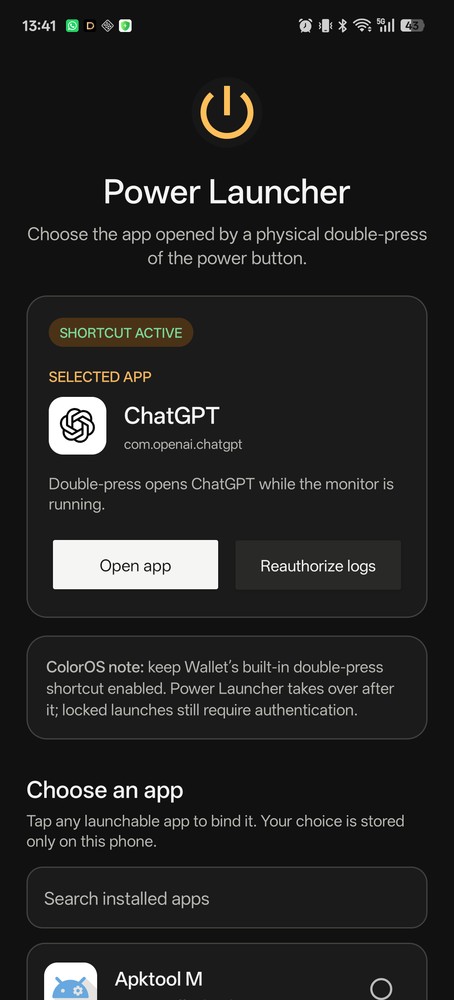

# ColorOS Power Launcher

A small offline Android utility that lets you choose the app opened by a physical power-button double-press on ColorOS. It was created for OPPO firmware that hard-wires the gesture to Wallet and does not expose a normal app picker.



## Features

- Chooses any installed launchable app, with search and a one-tap test button.
- Opens the selected app immediately when the phone is already unlocked.
- Requests authentication first when the secure lock screen is showing, then opens the app as soon as ColorOS completes the unlock transition.
- Starts its monitor after app updates and phone restarts.
- Supports Android light and dark themes, large touch targets, and screen-reader labels.
- Uses no network permission, analytics, ads, root, or Accessibility service.

## Requirements

- Android 12 or newer (`minSdk 31`).
- OPPO, OnePlus, or realme firmware with the same ColorOS power-policy log format.
- The built-in power-button double-press Wallet shortcut enabled in ColorOS.
- A one-time ADB command to grant `READ_LOGS`. ADB is not required to install the APK.

This project was developed and tested on an OPPO PMA120 running Android 16 / ColorOS 16.1. Other devices and firmware versions may use a different policy log tag or may block the background handoff.

## Install

1. Download the APK from the [latest GitHub release](https://github.com/Nielk74/coloros-power-button-launcher/releases/latest).
2. Install it normally by opening the APK on your phone. **You do not need ADB to install the app.**
3. Enable USB or wireless debugging and connect the phone to a computer with [Android Platform Tools](https://developer.android.com/tools/releases/platform-tools).
4. In ColorOS **Developer options**, temporarily turn on **Disable system optimization**. This only allows the ADB permission command below to work; it does not grant the permission itself.
5. Run:

   ```text
   adb shell pm grant com.nielk74.colorospowerlauncher android.permission.READ_LOGS
   ```

6. Turn **Disable system optimization** back off immediately. It does not need to remain enabled.
7. Open **ColorOS Power Launcher**, finish the setup cards, select an app, and approve Android's device-log dialog.
8. Keep ColorOS's built-in Wallet double-press shortcut enabled.

If you installed v1.0.0, uninstall it first. The cleaner package name in v1.1.0 makes Android treat it as a separate app, and running both versions would start two power-button monitors.

Installing with ADB is optional. If preferred, the included PowerShell helper installs the APK, grants the permission, and opens the app:

```powershell
.\install.ps1 -Serial '<device-ip>:<port>'
```

After a phone restart, tap the persistent **Power shortcut active** notification and choose **Allow** in Android's device-log dialog again. That one-time approval lasts while the foreground monitor process remains alive.

### Why is `READ_LOGS` needed?

Android does not let a normal app receive global power-button presses, and ColorOS does not provide an app picker for this shortcut. Power Launcher detects the two physical presses from a narrowly filtered ColorOS system log. Android treats access to that log as a development permission, so the APK cannot grant it to itself and the one-time ADB command is required.

## Why Wallet must stay enabled

On the tested firmware, changing Android's standard camera double-tap setting does not change the OEM action. The Wallet shortcut is the part of ColorOS that keeps the first power press from immediately locking the screen and supplies the native multi-press window. Power Launcher detects the two real hardware key-downs and brings the selected app forward after the second press.

Wallet can flash briefly before the selected app on some firmware. The helper minimizes that interval, but removing Wallet entirely also removes the OEM delay that makes an unlocked double-press possible.

## Privacy and security

The monitor starts `logcat` with an explicit allow-list for only this ColorOS tag:

```text
KEYLOG_PhoneWindowManagerExtImpl
```

It accepts only non-synthetic `KEYCODE_POWER` down events and ignores `deviceId=-1`. The display-over-apps permission is used for a transparent, non-touchable 1×1-pixel window that helps Android authorize the activity handoff. No log content or app choice leaves the device; the manifest has no internet permission.

## Build

The app has no third-party runtime dependencies. Install Android SDK 36 and JDK 17, then run:

```powershell
.\build.ps1
```

Or use Gradle directly:

```powershell
.\gradlew.bat lintDebug assembleDebug
```

The convenience script writes `build\ColorOS-Power-Launcher-v1.1.0.apk`. Public release APKs are signed separately; no signing credentials are stored in this repository.

## Known limitations

- Compatibility depends on an undocumented ColorOS log tag and may break after an OEM update.
- The persistent foreground service and one-time device-log approval are required for reliable detection.
- Locked launches always respect Android authentication; the app does not bypass the keyguard.
- Some ColorOS builds may show Wallet briefly or need battery/background-activity allowances adjusted manually.

This is an independent utility and is not affiliated with OPPO, OnePlus, realme, Google, OpenAI, or any selected app vendor.
